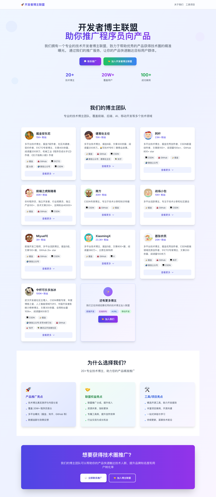
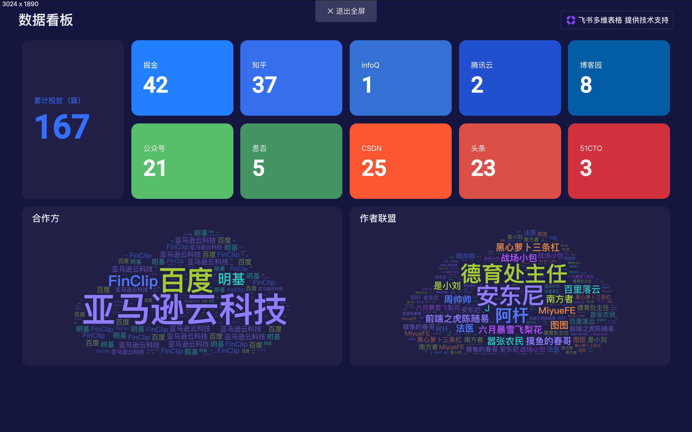

# 🧭 Blogger Alliance - 技术影响力平台

🌐 **网站地址：** https://blogger-alliance.pages.dev/




> **项目介绍：Blogger Alliance 网站构建说明（对内版）**

## 🔍 这是个什么项目？

我们正在搭建一个网站，代号 **Blogger Alliance（开发者博主联盟）**，这是一个面向一线程序员博主的"影响力平台"。

简单来说，我们有一批做内容的技术博主，未来会越来越多，我们希望通过这个平台，把"人"作为核心资源，用技术人的方式影响技术人，从而：

- **帮助程序员相关产品进行精准推广**（对 B 端）
- **搭建 C 端博主的成长入口**（加入联盟、有内容、有收入）
- **给普通开发者提供好用、有用、真实推荐的工具与应用**（资源库）

## 📊 数据分析



## 🤝 加入开发者联盟

### 🎯 如何加入？

如果你想加入我们的开发者联盟，请按照以下规范流程操作：

#### 1️⃣ Fork 项目
首先 Fork 这个项目到你的 GitHub 账号下

#### 2️⃣ 创建功能分支
```bash
# 克隆你的 Fork 仓库
git clone https://github.com/你的用户名/blogger-alliance.git
cd blogger-alliance

# 创建新的功能分支（请使用有意义的分支名）
git checkout -b feature/add-blogger-你的名字
```

#### 3️⃣ 修改数据文件
编辑 `src/data/bloggerInfo.js` 文件，在 `bloggersData` 数组中添加你的信息：

```javascript
{
  id: 下一个可用ID, // 请查看现有数据的最大ID，然后+1
  name: '你的名字',
  avatar: '你的头像URL', // 建议使用 DiceBear API 生成
  introduction: '简短的个人介绍（50字以内）',
  followers: '粉丝数量+K',
  socialAccounts: [
    { platform: '掘金', url: '你的掘金链接', icon: '📝' },
    { platform: 'GitHub', url: '你的GitHub链接', icon: '🐙' },
    { platform: 'CSDN', url: '你的CSDN链接', icon: '💻' }
    // 可以添加更多平台
  ],
  expandedContent: {
    specialties: ['你的专长领域1', '专长领域2', '专长领域3'],
    achievements: ['你的成就1', '成就2', '成就3'],
    recentPosts: ['最近文章1', '最近文章2', '最近文章3']
  }
}
```

#### 4️⃣ 提交你的更改
```bash
# 添加修改的文件
git add src/data/bloggerInfo.js

# 提交更改（请使用规范的提交信息）
git commit -m "feat: add new blogger - 你的名字"

# 推送到你的 Fork 仓库
git push origin feature/add-blogger-你的名字
```

#### 5️⃣ 创建 Pull Request
1. 访问你的 GitHub Fork 仓库
2. 点击 "Compare & pull request" 按钮
3. 填写 PR 标题：`feat: add new blogger - 你的名字`
4. 在描述中说明：
   - 你的技术背景
   - 主要创作平台和粉丝数
   - 加入联盟的动机
   - 你能为联盟带来什么价值

#### 6️⃣ 等待审核
我们会审核你的申请，通常会在 3-5 个工作日内回复。

### 📋 加入要求

- ✅ 有稳定的技术内容创作（建议 50+ 篇技术文章）
- ✅ 在主流技术平台有活跃账号（掘金、CSDN、GitHub 等）
- ✅ 有一定的粉丝基础（建议 3k+ 左右粉丝）
- ✅ 愿意分享真实的技术经验和产品使用心得
- ✅ 认同我们的价值观：真实、专业、有温度

### 🐛 提 Issue 指南

如果你有其他建议或发现问题，欢迎提 Issue：

#### Issue 类型
- 🐛 **Bug 报告** - 网站功能问题
- 💡 **功能建议** - 新功能或改进建议
- 📝 **文档改进** - README 或文档相关
- 🤝 **联盟相关** - 关于联盟运营的建议
- ❓ **问题咨询** - 其他问题

#### Issue 模板
```markdown
## 问题类型
- [ ] Bug 报告
- [ ] 功能建议
- [ ] 文档改进
- [ ] 联盟相关
- [ ] 问题咨询

## 详细描述
请详细描述你的问题或建议...

## 期望结果
你希望看到什么样的结果？

## 其他信息
任何其他相关信息...
```

### 📞 联系我们

- 📧 邮箱：tuaran666@gmail.com
- 💬 微信群：添加微信 atar24 邀请进入

- 🐦 微博：@BloggerAlliance

---

## 🤝 我们和其他 IT KOL 的区别？

| 传统 IT KOL | Blogger Alliance |
|-------------|------------------|
| 多为"泛测评"内容 | 以"真实使用 + 开发者视角"为基础 |
| 多靠平台流量支持 | 我们建设自己的产品入口与平台 |
| 和开发距离远 | 本质上是"写代码的人做内容" |
| 重视粉丝数 | 我们更重视"转化率"与"推荐真实感" |

我们强调的是「创作力」+「信任力」+「转化力」。


## 📁 目录结构

```
blogger-alliance/
├── src/
│   ├── pages/                     # 页面模块
│   │   ├── tob/                   # ToB 推广服务页面
│   │   │   └── index.vue
│   │   └── toc/                   # ToC 博主合伙人和工具库页面
│   │       └── index.vue
│   ├── views/                     # 视图组件
│   │   ├── Home.vue               # 首页 - 平台概览
│   │   ├── Tools.vue              # 工具库页面
│   │   └── About.vue              # 关于页面
│   ├── data/
│   │   └── bloggerInfo.js         # 博主信息数据
│   ├── components/                # 通用组件
│   ├── utils/                     # 工具函数
│   ├── App.vue                    # 根组件
│   ├── main.js                    # 入口文件
│   └── style.css                  # 全局样式
├── .github/                       # GitHub 配置文件
├── index.html
├── package.json
├── vite.config.js
├── tailwind.config.js
└── README.md
```

## 🤝 贡献

欢迎提交 Issue 和 Pull Request！

---

**Blogger Alliance** - 技术人影响力平台 🚀