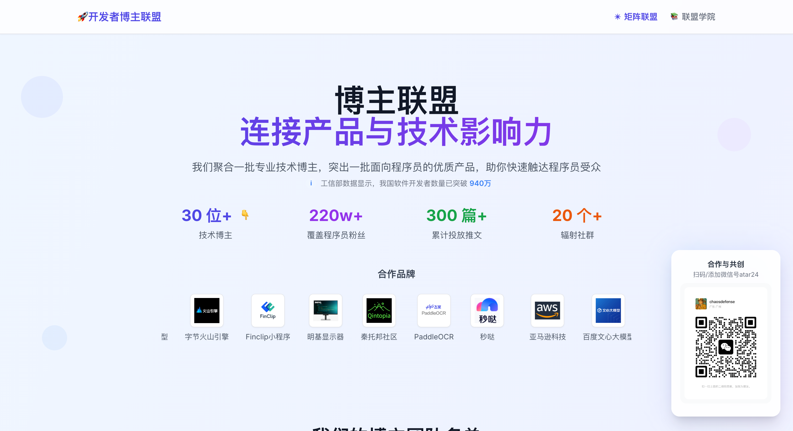
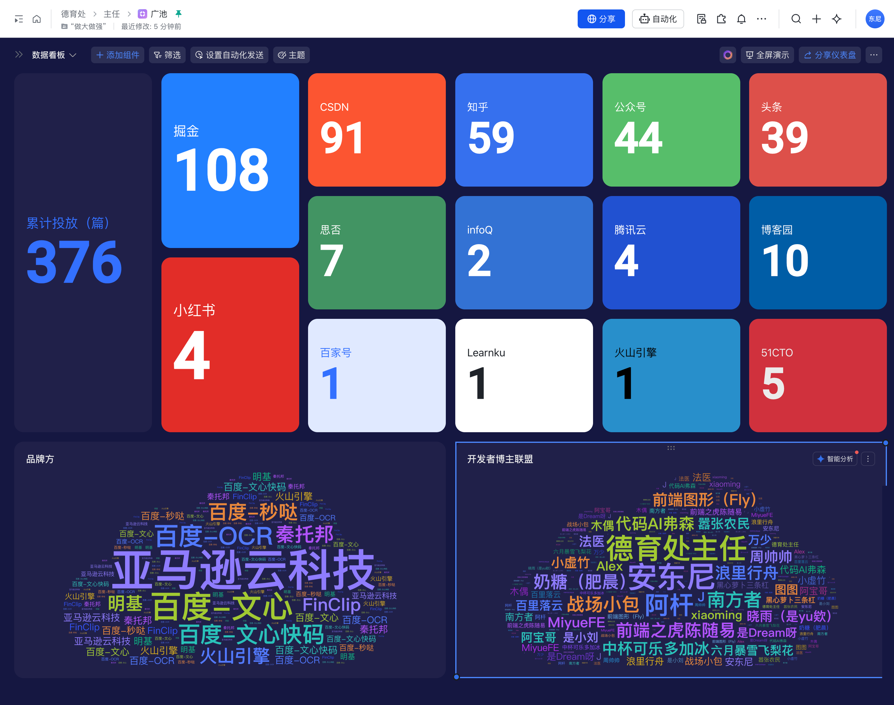

# 🧭 Blogger Alliance - 技术影响力平台

🌐 **网站地址：** https://blogger-alliance.cn/




> **项目介绍：Blogger Alliance 网站构建说明（对内版）**

## 🔍 这是个什么项目？

我们正在搭建一个网站，代号 **Blogger Alliance（博主联盟）**，这是一个面向一线程序员博主的"影响力平台"。

简单来说，我们有一批做内容的技术博主，未来会越来越多，我们希望通过这个平台，把"人"作为核心资源，用技术人的方式影响技术人，从而：

- **帮助程序员相关产品进行精准推广**（对 B 端）
- **搭建 C 端博主的成长入口**（加入联盟、有内容、有收入）
- **给普通开发者提供好用、有用、真实推荐的工具与应用**（资源库）

## 📊 数据分析



## 🤝 加入博主联盟

### 🎯 如何加入？

如果你想加入我们的开发者联盟，请按照以下规范流程操作：

#### 1️⃣ Fork 项目
首先 Fork 这个项目到你的 GitHub 账号下

#### 2️⃣ 创建功能分支
```bash
# 克隆你的 Fork 仓库
git clone https://github.com/你的用户名/blogger-alliance.git
cd blogger-alliance

# 创建新的功能分支（请使用有意义的分支名）
git checkout -b feature/add-blogger-你的名字
```

#### 3️⃣ 修改数据文件
编辑 `src/data/bloggerInfo.js` 文件，在 `bloggersData` 数组中添加你的信息：

```javascript
{
  id: 下一个可用ID, // 请查看现有数据的最大ID，然后+1
  name: '你的名字',
  avatar: '你的头像URL', // 建议使用 DiceBear API 生成
  introduction: '简短的个人介绍（50字以内）',
  followers: '粉丝数量+K',
  socialAccounts: [
    { platform: '掘金', url: '你的掘金链接', icon: '📝' },
    { platform: 'GitHub', url: '你的GitHub链接', icon: '🐙' },
    { platform: 'CSDN', url: '你的CSDN链接', icon: '💻' }
    // 可以添加更多平台
  ],
  expandedContent: {
    specialties: ['你的专长领域1', '专长领域2', '专长领域3'],
    achievements: ['你的成就1', '成就2', '成就3'],
    recentPosts: ['最近文章1', '最近文章2', '最近文章3']
  }
}
```

#### 4️⃣ 提交你的更改
```bash
# 添加修改的文件
git add src/data/bloggerInfo.js

# 提交更改（请使用规范的提交信息）
git commit -m "feat: add new blogger - 你的名字"

# 推送到你的 Fork 仓库
git push origin feature/add-blogger-你的名字
```

#### 5️⃣ 创建 Pull Request
1. 访问你的 GitHub Fork 仓库
2. 点击 "Compare & pull request" 按钮
3. 填写 PR 标题：`feat: add new blogger - 你的名字`
4. 在描述中说明：
   - 你的技术背景
   - 主要创作平台和粉丝数
   - 加入联盟的动机
   - 你能为联盟带来什么价值

#### 6️⃣ 等待审核
我们会审核你的申请，通常会在 3-5 个工作日内回复。

### 📋 加入要求

- ✅ 有稳定的技术内容创作（建议 50+ 篇技术文章）
- ✅ 在主流技术平台有活跃账号（掘金、CSDN、GitHub 等）
- ✅ 有一定的粉丝基础（建议 3k+ 左右粉丝）
- ✅ 愿意分享真实的技术经验和产品使用心得
- ✅ 认同我们的价值观：真实、专业、有温度

## 🤝 我们和其他 IT KOL 的区别？

| 传统 IT KOL | Blogger Alliance |
|-------------|------------------|
| 多为"泛测评"内容 | 以"真实使用 + 开发者视角"为基础 |
| 多靠平台流量支持 | 我们建设自己的产品入口与平台 |
| 和开发距离远 | 本质上是"写代码的人做内容" |
| 重视粉丝数 | 我们更重视"转化率"与"推荐真实感" |

我们强调的是「创作力」+「信任力」+「转化力」。


## 🤝 贡献

欢迎提交 Issue 和 Pull Request！

## 🔐 合作查询数据维护（内部协作）

合作查询页使用密文文件：

- [src/data/commercialDeals.encrypted.js](src/data/commercialDeals.encrypted.js)
- [src/data/promotionReports.encrypted.js](src/data/promotionReports.encrypted.js)

### 1) 明文源数据放哪里？

- 本地明文默认路径：`private/commercialDeals.source.json`
- 该目录已在 `.gitignore` 中忽略，不会进入仓库。
- 可参考示例结构：`src/data/commercialDeals.source.example.json`

### 2) 如何解密到本地（用于新增/编辑）

```bash
DEALS_CREDENTIAL=你的6位凭证 npm run deals:decrypt
```

执行后会生成本地明文：`private/commercialDeals.source.json`

### 3) 如何新增商单并重新加密

1. 编辑 `private/commercialDeals.source.json`
2. 执行：

```bash
DEALS_CREDENTIAL=你的6位凭证 npm run deals:encrypt
```

3. 提交密文文件变更：`src/data/commercialDeals.encrypted.js`

### 4) 协作建议（推荐）

- 统一由 1~2 位维护人掌管凭证并负责加密发布。
- 团队成员通过私有表格或内部文档提交新增商单信息。
- 公开仓库只保留密文，不存明文业务数据。

## 🔐 数据报告维护（内部协作）

报告查询页同样使用密文文件：

- [src/data/promotionReports.encrypted.js](src/data/promotionReports.encrypted.js)

### 1) 固定模板在哪里？

- 本地实际数据文件：`private/promotionReports.source.json`
- 本地固定模板文件：`private/promotionReports.template.json`
- 仓库示例文件：`src/data/promotionReports.source.example.json`

推荐流程：

1. 复制 `private/promotionReports.template.json` 里的对象结构
2. 粘贴到 `private/promotionReports.source.json` 数组中
3. 只改字段值
4. 执行加密命令

### 2) 字段说明

- `id`：报告唯一业务 ID，建议格式：`report-YYYYMMDD-序号`
- `title`：报告标题，当前统一使用 `数据报告`
- `project`：合作项目名称，例如 `向日葵AI 合作`
- `author`：执行人姓名
- `period`：统计周期展示文案
- `publishedAt`：发布时间戳，使用 ISO 格式，例如 `2026-03-12T10:00:00+08:00`
- `platforms`：推广平台数组，例如 `[`公众号`, `CSDN`, `知乎`]`
- `content`：完整报告正文

### 3) 新增一条数据报告

1. 编辑 `private/promotionReports.source.json`
2. 按模板新增一个对象
3. 执行：

```bash
DEALS_CREDENTIAL=你的6位凭证 npm run reports:encrypt
```

4. 提交密文文件变更：`src/data/promotionReports.encrypted.js`

### 4) 如需查看当前报告明文

```bash
DEALS_CREDENTIAL=你的6位凭证 npm run reports:decrypt
```

### 5) 推荐维护方式

- 先在 `private/promotionReports.source.json` 维护所有报告
- 每次只新增或修改 JSON，不直接改前端页面
- 修改完成后只执行一次 `npm run reports:encrypt`
- 页面会自动读取新的密文数据

---

**Blogger Alliance** - 技术人影响力平台 🚀